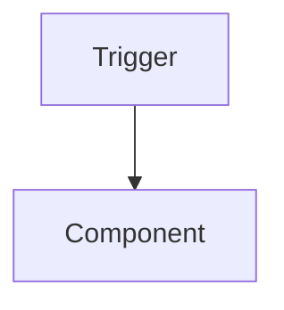

<!-- ALDC Core Template — IMMUTABLE. Do NOT edit this file directly.
     Copy to app/requirements/{req_status}/{req_name}/{req_name}.architecture.md and fill in.
     {req_status} = in-progress while active, archived once the requirement ships.
     HIGH complexity only — at MEDIUM the decisions live in the spec's §Decisions section. -->

# Architecture: {Feature Name}

**Date**: YYYY-MM-DD · **Complexity**: HIGH · **Author**: al-architect · **Status**: [Proposed / Approved / Implemented / Superseded]

> **Skills applied**: {skills actually loaded during design, or "None"}

This document holds **decisions, risks, diagrams and quality constraints only**. Objects, IDs,
fields, procedure signatures, events, permissions and tests belong to `{req_name}.spec.md`;
the work-package plan belongs to al-conductor. Do not restate them here.

---

## 1. Summary & Success Criteria

{2-3 sentences: what the feature is, what it solves, the high-level approach.}

| ID | Criterion | Observable |
|----|-----------|------------|
| AC-01 | {Outcome the business expects} | {How we will verify it} |

## 2. Solution Architecture

{The chosen pattern (event-driven extension, stored fields vs FlowFields, sync vs job queue,
…) and *why*. Up to 3 Mermaid diagrams (data flow, process flow, object relationships) — only
where a diagram shows what prose cannot.}

## 3. Integration Boundaries

{External systems, inbound/outbound direction, sync model, failure/retry behaviour, auth.
Name the base-app areas hooked into at the level of "posting routine", not event signatures —
the spec verifies and records the exact events.}

## 4. Quality Constraints

{Security model (permission strategy, data classification, multi-company), performance
(volumes, set-based vs iterative, batch strategy — see `skill-performance`), upgrade and
rollback (data migration, idempotency, uninstall behaviour).}

## 5. Technical Decisions

{At least 3 — each with a genuine rejected alternative; never padded.}

### TD-01: {Decision Title}

- **Problem**: {What had to be decided}
- **Decision**: {Chosen approach}
- **Alternatives rejected**: {What else was considered}
- **Rationale**: {Why this is the right call here}

## 6. Risks & Mitigations

{At least 3 feature-specific risks — no boilerplate.}

| ID | Risk | Likelihood | Impact | Mitigation |
|----|------|-----------|--------|------------|

## 7. Spec Decomposition *(omit if one spec suffices)*

| Spec ID | Scope | Depends on |
|---------|-------|------------|

---

## Rules

- HIGH only. MEDIUM features record their decisions in the spec's §Decisions instead.
- No AL code, no object/ID tables, no procedure signatures, no phase or test lists.
- Every decision, risk and diagram must be load-bearing; counts are minimums for
  auditability, not targets.
- Keep **Status** current: `Proposed` → `Approved` → `Implemented` → `Superseded`.
- The `> Skills applied:` line is mandatory (write "None" if none).
